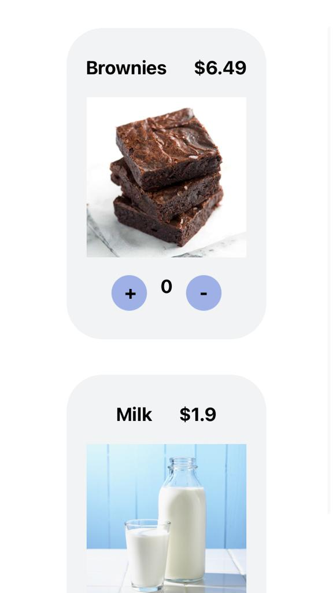

# React Native GDSC course 2022

## Workshop 1 -- installation guide

1. Download an IDE (Visual Studio Code, WebStorm ...)
2. Download Xcode / Android Studio for simulators / emulators -- expo
3. Download Node.js LTS.
4. Install expo-cli globally: `npm i -g expo-cli`
5. Initialize an application in the current directory: `expo init . --npm`
6. Run the application: `npm start`
7. Scan the QR code / run the app in a simulator / emulator

## Homework 1

## Workshop 2 -- components

## Homework 2

